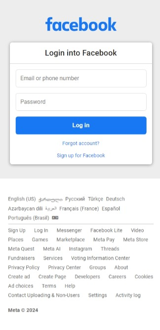

# Facebook Authentication Clone

live: [here](https://gp-facebook-authentication-clone)

A clone of the Facebook login and sign-up pages designed to replicate the look and feel of the original interface. This project provides a practice environment for front-end development and authentication processes.

## Features

- **Facebook-like UI**: Replicates the Facebook login and sign-up interface for a familiar user experience.
- **Responsive Design**: Ensures the pages look great on all devices, including desktops, tablets, and mobile phones.
- **Form Validation**: Provides basic form validation for the login and sign-up forms.
- **Interactive Elements**: Includes interactive elements such as input fields and buttons.

## Technologies Used

- **HTML**: For structuring the content on the web.
- **CSS**: For styling the application.
  - Flexbox and Grid: For layout structure.
  - Media Queries: For responsive design.
- **JavaScript**: For client-side logic and interactivity.

## Getting Started

### Prerequisites

You need a modern web browser to run this application.

### Installation

1. Clone the repository:
    ```bash
    git clone https://github.com/gabriel-pipia/facebook-authentication-clone.git
    ```

2. Navigate to the project directory:
    ```bash
    cd facebook-authentication-clone
    ```

3. Open `index.html` in your favorite web browser.

## Usage

1. Open the application in your browser.
2. Use the login form to simulate logging into Facebook.
3. Use the sign-up form to simulate creating a new Facebook account.

## Project Structure

- `index.html`: Main HTML file for the login and sign up.
- `css/style.css`: CSS file for styling the application.
- `css/variables.css`: CSS file for variables.
- `css/media_query.css`: CSS file for responsive design.
- `js/script.js`: JavaScript file for interactivity.
- `README.md`: Project documentation.

## Screenshots




## Live Demo

Check out the live demo of the application: [Facebook Authentication Clone](https://gp-facebook-authentication-clone)

## License

This project is licensed under the MIT License. See the [LICENSE](LICENSE) file for details.

## Acknowledgements

- [Facebook](https://www.facebook.com/) for the design inspiration.
- [Font Awesome](https://fontawesome.com/) for icons.

## Author

Gabriel Pipia
- [GitHub](https://github.com/gabriel-pipia)

Feel free to contribute, open issues, or provide feedback!

---

Thank you for checking out this project!